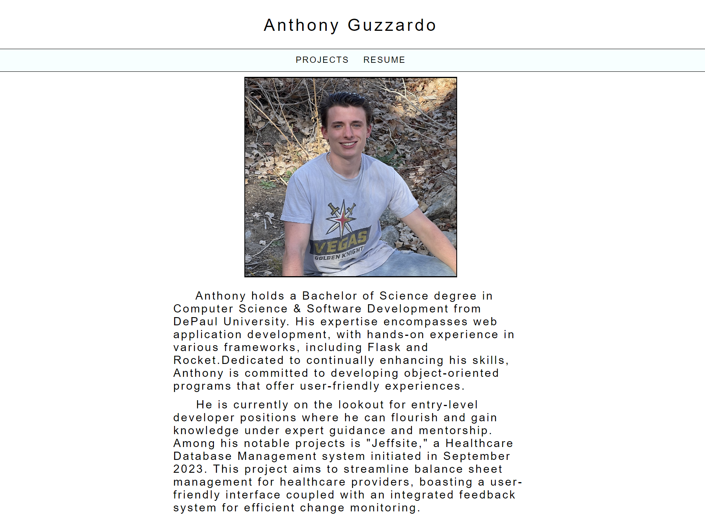

# my_website


A clean informative website about Software Developer Anthony Guzzardo
'
## Installation
1. Clone GitHub Repository to Local Machine
```powershell
git clone https://github.com/aguzzar2/Rust.Projects.git
```

3. If you're running windows and don't already have Rust installed, you can do so from this link: 
https://www.rust-lang.org/tools/install . Otherwise confirm what version of rust you are on <strong>rustc --version</strong>. You may want to update <strong>rustup update</strong>.

4. Rust is installed using <strong>rustup</strong> tool.
```powershell
rustup
```

5.  Check to see what version you are running. Mine is Nightly.
```powershell
rustc --version
rustc 1.75.0-nightly (31bc7e2c4 2023-10-30)
```

- There are 3 rust channels <strong>[Nightly, Beta, Stable]</strong>. Nightly and Beta are unstable channels used for more experimental projects. Beta is ahead of Stable, and Nightly is ahead of Beta. So if you want to get ahead and write for what will eventually be on Stable you can try your hand at Nightly. Nightly channel releases updates, you guessed it, nightly.

6. Toggling between Channels is very easy.
```powershell
rustup default nightly
rustup default beta
rustup default stable
```
## Execute Web Application
1. Navigate to <strong>my_website</strong> directory inside of the GitHub Repo and execute to release the web application locally.
```powershell
./release/Target/controller
```